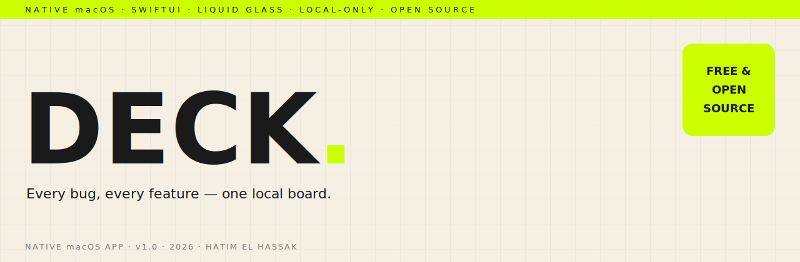

<p align="center">
  <picture>
    <source media="(prefers-color-scheme: dark)" srcset="assets-readme/hero-banner-dark.svg" />
    
  </picture>
</p>

<p align="center">
  
  
  
  
  
  
</p>

<p align="center">
  <em>A native macOS app for tracking what you're building. Deck replaces the messy Apple-Notes-folder setup with a bird's-eye board of project cards — each showing how many bugs and features are still pending vs done — a focused three-pane editor for writing updates with bullets and images, and a lift-to-complete drag-and-drop that makes finishing things feel good. Everything is local, no account, no servers. Built in SwiftUI with Liquid Glass.</em>
</p>

---

### `/// WHAT IT IS`

```
┌──────────────┬─────────────────────────────┬───────────────────────────┐
│ CATEGORIES   │ DASHBOARD (full screen)     │ STATS (full screen)       │
│ ▸ Work       │ ▸ Project cards by category │ ▸ Done today / week /     │
│ ▸ Personal   │ ▸ pending · done counts     │   month / year / lifetime │
│ ▸ Wife       │ ▸ 🐞 bugs · ✨ features     │ ▸ open bugs / features    │
│ ▸ + add      │ ▸ color-themed glass        │ ▸ shipped totals          │
├──────────────┴─────────────────────────────┴───────────────────────────┤
│ OPEN A PROJECT → three panes                                            │
│  Categories  │  Notes (filter: All · Bug · Feature · Both · Show Done)  │
│              │  Editor — title, Bug/Feature toggles, Done switch,       │
│              │  bullets, inline images, copy & export (PDF / RTFD)      │
├─────────────────────────────────────────────────────────────────────────┤
│ DRAG A NOTE → the screen blurs → drop on  ✓ Done  or  🗑 Delete         │
└─────────────────────────────────────────────────────────────────────────┘
```

---

### `/// WHY IT EXISTS`

I track updates for a lot of apps. For a while that lived in Apple Notes — a folder per app, sub-folders for *pending* and *done*. It worked with one or two projects and fell apart at ten: no rollup counts, no way to see how many bugs I'd actually closed, no slicing by who the work is for.

Deck fixes exactly that and nothing else. Open it and you see every project as a card with live counts. Click in and you get a clean editor. Mark things done by flinging them at a target. No backlog of features you'll never use, no cloud, no login — just the job it's supposed to do, fast and good-looking.

---

### `/// HIGHLIGHTS`

```
DASHBOARD     Full-screen grid of project cards, grouped by category,
              each with pending/done and bug+feature counts at a glance.

NOTES         A note can be a Bug, a Feature, or both — counts add to each.
              Filter by All · Bug · Feature · Both; hide Done by default.

EDITOR        Rich text: bullets, inline images, ⌘B/⌘I, copy-with-formatting,
              export to PDF or RTFD. Paste straight from Apple Notes.

DRAG          Lift a note → the world blurs → magnetic Done / Delete targets
              with real spring physics. Right-click to move between projects.

STATS         Completed today / this week / month / year / lifetime, plus
              open bugs, open features, and lifetime shipped.

DESIGN        Liquid Glass throughout, per-category color themes, soft scroll
              edges, native macOS feel (menu bar, ⌘N, keyboard, Settings).

LOCAL         SwiftData stored on your Mac, outside the app bundle, with an
              automatic backup on every launch. Nothing ever leaves the device.
```

---

### `/// INSTALL`

```
1.  Download Deck.dmg from the latest release ↓
2.  Open it and drag Deck into Applications
3.  First launch:  right-click Deck → Open   (or System Settings →
    Privacy & Security → "Open Anyway")
```

> [!NOTE]
> Deck is **ad-hoc signed, not notarized** (no paid Apple Developer account, like most open-source Mac apps). macOS asks you to confirm once on first launch — after that it opens normally.

**[⬇ Download the latest release](https://github.com/hatimhtm/Deck/releases/latest)**

---

### `/// UPDATES`

Updates are **manual and in-app**. When a new version is published here, Deck shows an **Update** badge in the sidebar — click it (or **Deck ▸ Check for Updates…**) for a one-click download → install → relaunch, with the changelog shown. Nothing downloads in the background; you're always in control. Your notes are stored outside the app, so updates never touch your data.

---

### `/// BUILD FROM SOURCE`

```bash
brew install xcodegen          # one-time
git clone https://github.com/hatimhtm/Deck.git
cd Deck
xcodegen generate              # produces Deck.xcodeproj from project.yml
open Deck.xcodeproj            # select the Deck scheme → Run  (Xcode 26)
```

Requires **macOS 26 (Tahoe)** and **Xcode 26**. To cut a release: bump
`MARKETING_VERSION` + `CURRENT_PROJECT_VERSION` in `project.yml`, add a section to
`CHANGELOG.md`, then run `scripts/release.sh` and publish with `gh release create`.

---

### `/// PRIVACY`

100% local. No account, no analytics, no network — except checking this GitHub repo for updates when you ask. Your data lives in `~/Library/Application Support/Deck/`.

---

<p align="center">
  <sub>Built by <a href="https://github.com/hatimhtm">Hatim El Hassak</a> · MIT licensed · made on macOS</sub>
</p>
